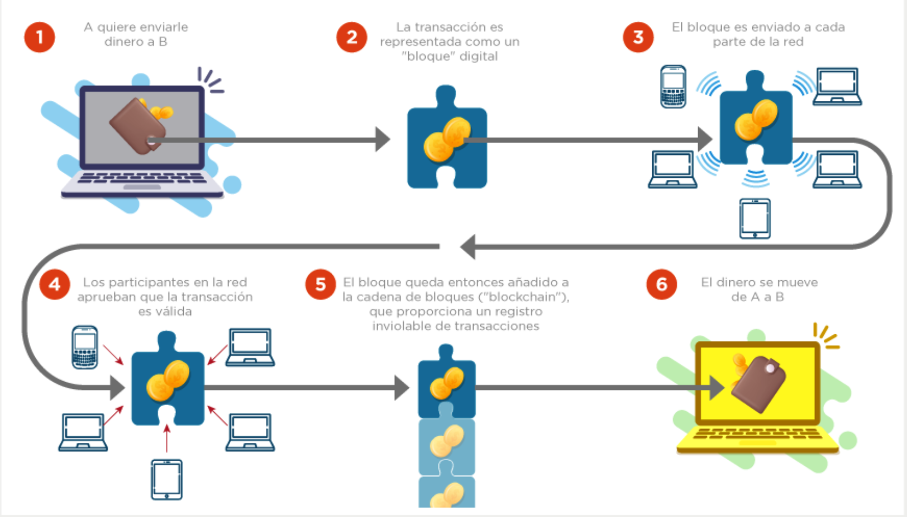
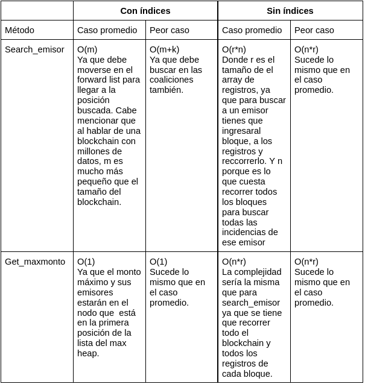
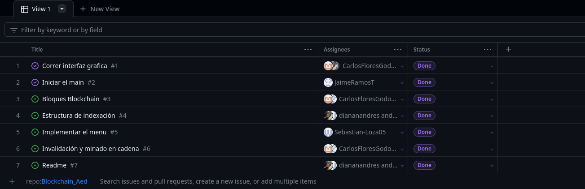

# Blockchain_Aed
Proyecto de Algoritmos y Estructura de Datos  - Blockchain
## Integrantes:
- Sebastián Loza Mendoza
- Diana Ñañez Andrés
- Jaime Ramos Talla
- Carlos Flores Godos

## Introducción:
Según el IBM el "Blockchain es un libro mayor compartido e inalterable que facilita el proceso de registro de transacciones y de seguimiento de activos en una red de negocios"(¿Qué es la tecnología Blockchain? - IBM Blockchain | IBM, s. f.). 
En otras palabras, este permite el intercambio de información de forma transparente, inmutable y sin la necesidad de intermediarios. Su impacto potencial abarca una amplia gama de industrias y sectores, desde las finanzas y la economía, hasta la logística, la atención médica y más.

El objetivo de este proyecto es explorar y desarrollar un blockchain funcional, brindando una comprensión más profunda de esta tecnología y su aplicación práctica. A través de la creación de un blockchain propio, podremos analizar y experimentar con los diferentes elementos que lo componen, como la estructura de bloques, la criptografía, la verificación de transacciones y la descentralización.

## Caso de Estudio:
**Blockchain en las Transferencias Bancarias**

Este, se trata de un registro digital seguro, que permite realizar las transferencias de manera eficaz, rápida y sin intermediarios, además utiliza la criptografía para que la integridad de los datos no se pierda, además esta tecnología nos brinda poder seguir el rastro de una transacción financiera, desde su origen hasta su destino final.

## Importancia del Blockchain:

El blockchain es importante en las transferencias bancarias debido a:

- Eficiencia y rapidez: Elimina intermediarios y permite transacciones directas y rápidas, reduciendo los tiempos de liquidación y retrasos.

- Reducción de costos: Al eliminar intermediarios y automatizar procesos, se reducen las tarifas de procesamiento y comisiones asociadas.

- Seguridad y autenticidad: Utiliza criptografía avanzada para garantizar la seguridad de las transacciones y prevenir el fraude.

- Transparencia y trazabilidad: Proporciona un registro transparente y público de todas las transacciones, permitiendo mayor trazabilidad de los fondos y previniendo actividades ilícitas.

- Transferencias internacionales simplificadas: Superan desafíos como tiempos de liquidación largos y conversiones de moneda costosas, facilitando pagos internacionales directos y rápidos.

- Inclusión financiera: Permite transferencias rápidas y seguras sin la necesidad de una cuenta bancaria tradicional, beneficiando a regiones con acceso limitado a servicios financieros.

## Estructura de Datos en el Blockchain:
-Proof of work:
La principal estructura de datos del Blockchain es una lista doblemente enlazada para guardar los bloques. Nos decidimos por esta estructura ya que estaríamos constantemente ingresando al back(), el último elemento de la lista, y en esta estructura su complejidad era O(1).

Asu vez tenemos una estructura Bloque que es la que almacenará toda la información de cada bloque el nro, el nonce, una lista de registros, el hash anterior y el hash del bloque mismo. Asu vez tenemos otros campos como valido y base, los cuales explicaremos luego.

Dentro de cada bloque tenemos una lisa de registros la cual es un circular array. Usamos esta estructura principalmente porque el acceso y el push back de esta estructura es de O(1) y no íbamos a necesitar hacer resize ya que teníamos una cantidad máxima específica de registros.

**Proof of work**
Primero, cabe mencioanr que usamos sha256 para hashear los bloques. Para esto creamos una función que mete todos los datos del bloque en un string y eso lo pasamos al sha256 para que nos genere el hash. 
Al momento de insertar o crear un bloque lo que hacemos es usar una función minar que nos valida que el hash del bloque cumpla con que los primeros caracteres sean igual al pow, haciendo un hash en bucle hasta que cumpla.

Al momento de insertar un registro a un bloque también se llama a esta función minar ya que el bloque se ha modificado.

Si se altera un bloque usamos una función que va a invalidar a todos los bloques siguientes a ese que se ha modifica incluyendolo a ese mismo. A su vez se usa una función para minar en cadena.

## Estructura de Datos Implementadas:
- Hash: Usamos una tabla hash para que cada que ingresemos un registro, esta tabla hash es un forward list que en cada posición tiene otro forward list que representará el chaining. Dichos forward lists internos guardan Entry's en cada posición los cuáles son structs que guardan como key el nombre del emisor y como value una lista de bloques en los que ha aparecido dicho emisor. De esta forma cada vez que se ingresa un registro al blockchain se agrega el emisor a la tabla hash de indexación que luego nos permitirá hacer una búsqueda más eficiente por emisor. 
- Heap: Implemtentamos la funcion del max-heap, funciona con cada registro que se va añadiendo, eso creará nodos, el cual cada uno de ellos tiene un monto(valor asociado al nodo), además dentro de ellos hay un forwad-list, donde se guardarán los emisores con el mismo monto, esto se hizo para evitar repeticiones, con la función hepify_up colocaremos al mayor monto en la primera posición , esta implementación fue con la finalidad de que nos permita acceder a los emisores con el mayor monto de las transacciones de una forma más eficiente. 

## Notación Big O de los métodos del Blockchain:
-Métodos de insertar y buscar:
**Insertar registro**
Nosotros para alamcenar los registros de un bloque usamor un circular array, el cual tiene complejidad O(1), por lo que nuestra funcionalidad para insertar un registro en un bloque es O(1).

También usamos la funcion back() de nuestra lista doblemente enlazada donde guardamos los bloques, como la lista doblemente enlazada usa un puntero al nodo final **"tail"** entonces es O(1).

Por lo que nuestra función para insertar un registro es O(1).

**Insertar en tabla hash**
En nuestra estructura de tabl hash usamos una estructura Entry que guarda el key y una lista de values que es un forward list. Al momento de insertar un value se usa el push front el cual es O(1).

Para insertar un nombre y sus bloque en nuestra tabla hash de indexación en el peor de los casos se tiene que realizar un rehashing lo cual tiene complejidad *O(n\*k)* donde k son las coalisiones. En el caso promedio nuestro insert es de O(k) = O(1). 

Sin embargo, en nuestra tabla hash usamos un forward list como nuestra tabla y al momento de insertar un elemento en una posición usamos el operador [] el cual tiene una complejidad de O(n) en el peor de los casos. 

Por lo que al final el insert en la tabla hash es O(n), donde n es la capacidad de la tabla hash.

**Insertar en max heap**
En nuestro heap de indexacion usamos una lista de Nodos, donde dichos nodos tienen un forward list de los nombres de los emisores. Para insertar un nuevo emisor ahí usamos push front que es O(1).

En el peor de los casos tenemos que hacer un rehashing cuando la capacidad de la lista se llenó, su complejidad es O(n), donde n es la cantidad de elementos del heap.

Al insertar hacemos un heapify up el cual tiene complejidad O(log(n)).

Por lo que al final nuestro insert en un caso promedio es de O(log(n)), pero en el peor de los casos es O(log(n) + n) = O(n)
   
  
-Tabla comparativa de Blockchain con índices vs sin índices:

## Conclusion:

A lo largo de este proyecto, nos enfocaremos en desarrollar un blockchain básico, pero sólido, que demuestre los principios fundamentales de esta tecnología. También consideraremos cómo podríamos expandir y mejorar nuestro blockchain en el futuro, y cómo podría aplicarse en casos de uso específicos para que pueda ofrecer soluciones innovadoras a problemas existentes en diferentes áreas, al proporcionar una infraestructura confiable y transparente para el intercambio de datos y activos.

En resumen, a través de este proyecto seguiremos experimentado la potencia y las posibilidades del blockchain. Hemos comprendido su importancia en la transformación digital, que el blockchain tiene el potencial de cambiar la forma en que interactuamos y realizamos transacciones en el futuro, lo cuál seguiremos implementando las funcionalidades necesarias para que nuestro blockchain funcione y sea seguro.

## Referencias bibliográficas:
¿Qué es la tecnología Blockchain? - IBM Blockchain | IBM. (s. f.). https://www.ibm.com/es-es/topics/blockchain

IDB Invest (s. f.). https://www.google.com/search?q=como+funciona+un+blockchain&rlz=1C5CHFA_enPE823PE823&sxsrf=APwXEdeLzvfT8Hs1dNmYUJNd8NKizuBJKw:1685506631809&source=lnms&tbm=isch&sa=X&ved=2ahUKEwj5wbjA2Z7_AhUkqZUCHejdCuUQ_AUoAnoECAEQBA&biw=1422&bih=765&dpr=1.8#imgrc=i9wLTn2vFb7pgM

## Lista de actividades concluidas por cada integrante del grupo:

## Librerías:

-Usaremos wxWidgets
Para desccargarlo ingresar al siguiente link:
https://www.wxwidgets.org/downloads/

-Para Hash
Para descargar el respositorio:
https://github.com/stbrumme/hash-library.git

